<div align="center">

# Design Kits

**Sixteen reconstructed design systems — tokens, component specs, isolated previews and full UI kits.**

Every kit is a self-contained folder of static files. No build step, no dependencies, no package manager:
open an HTML file in a browser and it renders exactly as shipped.

</div>

<table>
<tr>
<td width="50%" valign="top">

**Who this is for**

- **Designers** who want tokens, palette rules and a documented voice — not an official Figma file
- **Frontend** copying markup out of `preview/`, wiring `colors_and_type.css` into an existing project
- **Agents** reading `SKILL.md`, which states each system as a contract rather than as prose

</td>
<td width="50%" valign="top">

**What this is not**

- Not an official kit from Apple, Google, TikTok, Barbie, Anthropic, Vercel or ByteDance — see [NOTICE](NOTICE.md)
- Not an npm package, not Storybook, not a React or Vue implementation
- Not a complete product design system: most kits are 6 primitives and one scene; TRAE, TRAEWork and Volcengine are the deep ones

</td>
</tr>
</table>

<div align="center">

[](#kit-index)
[](#anatomy-of-a-kit)
[](#anatomy-of-a-kit)
[](#gallery)
[](#anatomy-of-a-kit)

[**Gallery**](#gallery) · [**Quick start**](#quick-start) · [**Kit index**](#kit-index) · [**Anatomy of a kit**](#anatomy-of-a-kit) · [**Using a kit**](#using-a-kit) · [**Tooling**](#tooling) · [**NOTICE**](NOTICE.md)

<sub>These are independent reconstructions built for reference and prototyping. They are **not** affiliated with, endorsed by, or official releases from the brands they are named after, and all product names, logos and brands remain the property of their respective owners. See [NOTICE](NOTICE.md).</sub>

</div>

---

## Gallery

Each thumbnail is a real screenshot of that kit's flagship UI kit page, captured at 1440×900.

<table>
<tr>
<td width="50%" valign="top">

### [21th](21th/) &nbsp;·&nbsp; `#0040FF`

<a href="21th/">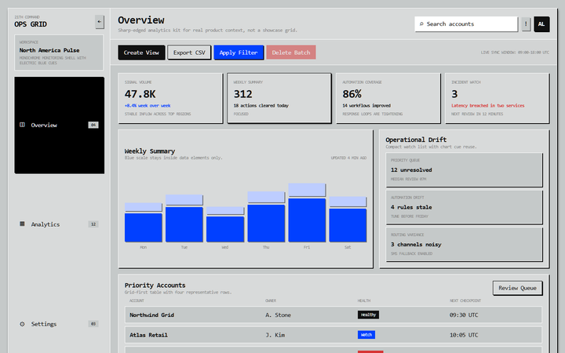</a>

Square-first analytics shell. Monochrome surfaces, electric blue rationed almost entirely to charts.

</td>
<td width="50%" valign="top">

### [Apple](Apple/) <sub>Pinguo</sub> &nbsp;·&nbsp; `#007AFF`

<a href="Apple/">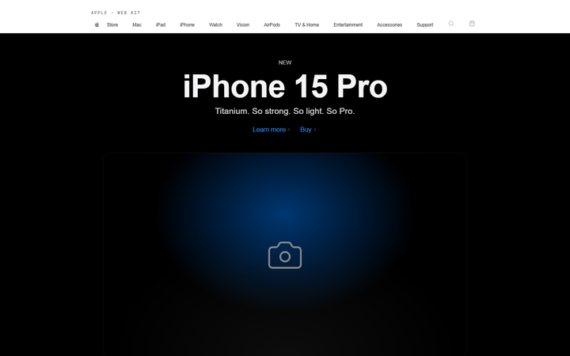</a>

Pinguo, a premium-retail reconstruction. Whitespace as structure, merchandising blocks, device-scale hero type.

</td>
</tr>
<tr>
<td width="50%" valign="top">

### [Barbie](Barbie/) &nbsp;·&nbsp; `#E91E63`

<a href="Barbie/">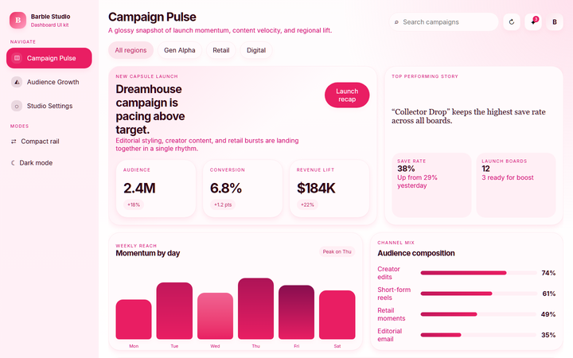</a>

Editorial pink dashboard. Campaign planning and content ops that stay dense under the glamour.

</td>
<td width="50%" valign="top">

### [Claude](Claude/) &nbsp;·&nbsp; `#C96442`

<a href="Claude/">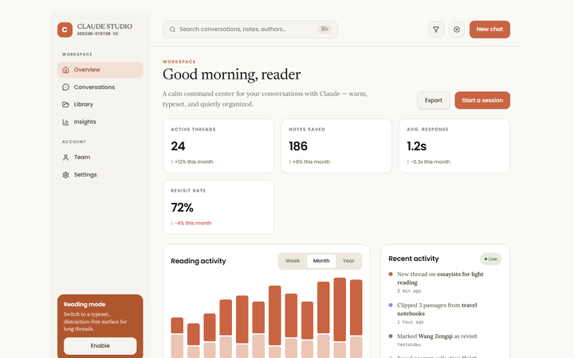</a>

Warm, calm, editorial. Built for AI chat and reading-first surfaces rather than slick futurism.

</td>
</tr>
<tr>
<td width="50%" valign="top">

### [Doubao](Doubao/) &nbsp;·&nbsp; `#0065FD`

<a href="Doubao/">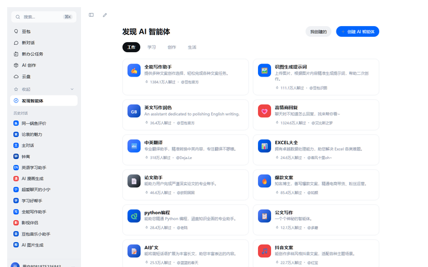</a>

Cool-toned technical AI dashboard. Token-first, light and dark from the same contract.

</td>
<td width="50%" valign="top">

### [GoldenTime](GoldenTime/) &nbsp;·&nbsp; `#3B3229`

<a href="GoldenTime/">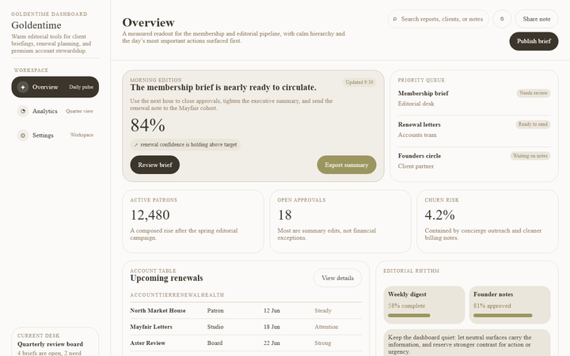</a>

Executive briefing language. Neutral surfaces carry the data; contrast is reserved for action and urgency.

</td>
</tr>
<tr>
<td width="50%" valign="top">

### [Google](Google/) &nbsp;·&nbsp; `#4285F4`

<a href="Google/">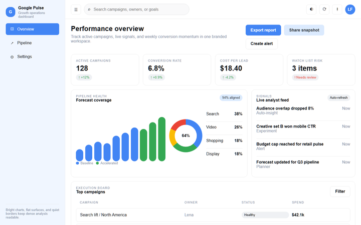</a>

Compact analytical reporting. Metrics, campaign state and performance summaries without visual noise.

</td>
<td width="50%" valign="top">

### [Minimalist](Minimalist/) &nbsp;·&nbsp; `#2563EF`

<a href="Minimalist/">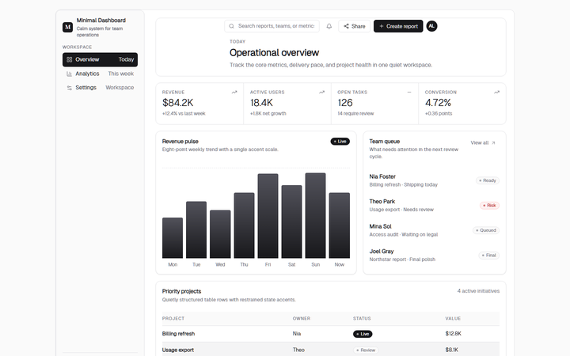</a>

Tight grayscale, rationed color. Framing and cadence do the work instead of decoration.

</td>
</tr>
<tr>
<td width="50%" valign="top">

### [MotionFit](MotionFit/) &nbsp;·&nbsp; `#FF4000`

<a href="MotionFit/">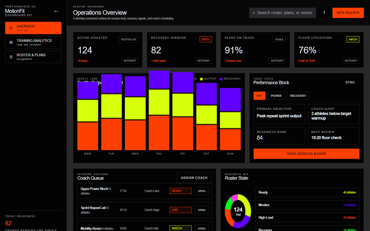</a>

Dark, high-energy fitness ops. Workouts, recovery, streaks and roster signals read at a glance.

</td>
<td width="50%" valign="top">

### [Nerv](Nerv/) &nbsp;·&nbsp; `#EA343A`

<a href="Nerv/">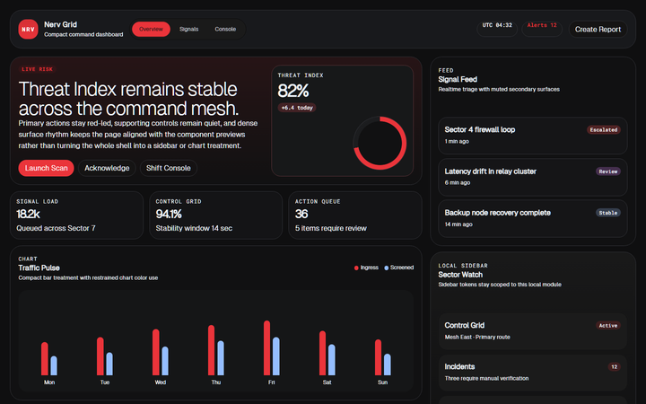</a>

Near-black operational monitoring. Status shifts and charted signals stay legible at high contrast.

</td>
</tr>
<tr>
<td width="50%" valign="top">

### [TikTok](TikTok/) &nbsp;·&nbsp; `#FE2C55`

<a href="TikTok/">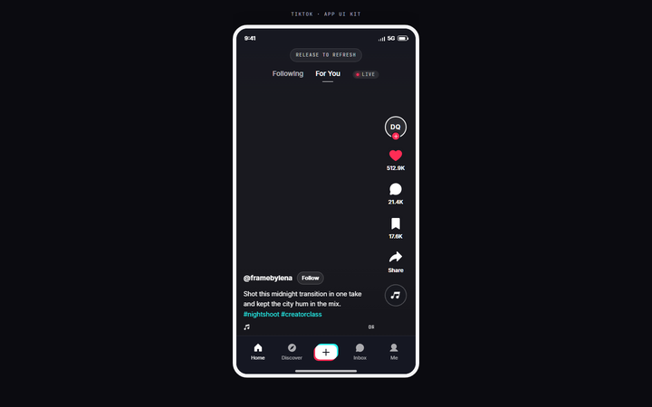</a>

Mobile-first short-form video. Creator-led feed surfaces and full-bleed media chrome.

</td>
<td width="50%" valign="top">

### [TRAE](TRAE/) &nbsp;·&nbsp; `#32F08C`

<a href="TRAE/">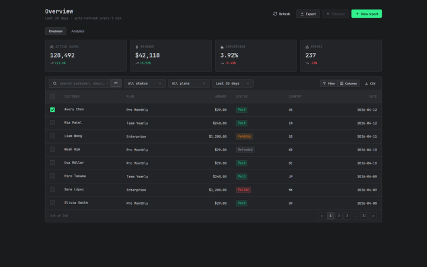</a>

Nimbus Core — dark-first developer tooling. The largest single-brand component set here after Volcengine.

</td>
</tr>
<tr>
<td width="50%" valign="top">

### [TRAEWork](TRAEWork/) &nbsp;·&nbsp; `#4B3FE3`

<a href="TRAEWork/">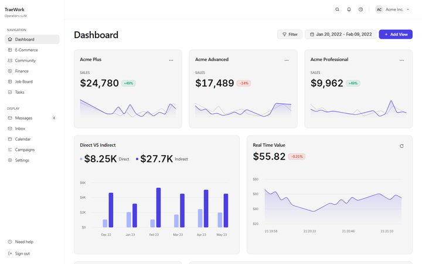</a>

Light-mode product library. Ten UI kit pages spanning dashboards, docs, pricing, settings and landing.

</td>
<td width="50%" valign="top">

### [Vercel](Vercel/) &nbsp;·&nbsp; `#121212`

<a href="Vercel/">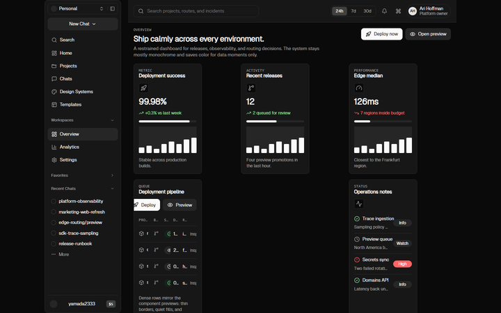</a>

Deploy-platform density. Crisp operational states, technical tone, no brand theater.

</td>
</tr>
<tr>
<td width="50%" valign="top">

### [VibeCamp](VibeCamp/) &nbsp;·&nbsp; `#F7663C`

<a href="VibeCamp/">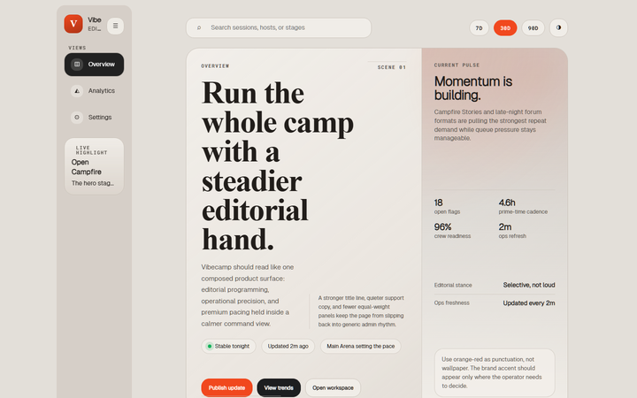</a>

Editorial dashboard with a real day/night mood shift. Analytics that still feel expressive.

</td>
<td width="50%" valign="top">

### [Volcengine](Volcengine/) &nbsp;·&nbsp; `#1664FF`

<a href="Volcengine/">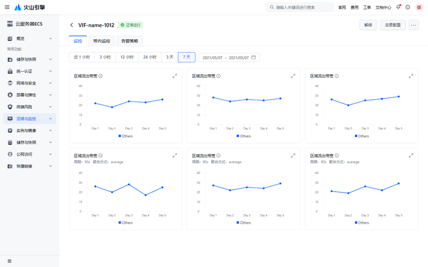</a>

源力 / Yuanli — B2B cloud console. The deepest kit: 34 components, 73 previews, 8 page archetypes.

</td>
</tr>
</table>

---

## Quick start

### The 20-second version

**Code → Download ZIP**, unzip, open `Claude/ui_kits/website/index.html` in a browser. That is the whole
setup — there is nothing to install and nothing to build.

Some pages pull fonts and icons at runtime (Google Fonts, unpkg, iconify), so keep a network connection
if you want them to look exactly like the [gallery](#gallery).

### 1. Get the files

**The whole collection** — 16 kits, about 23 MB of working tree:

```bash
git clone https://github.com/icsaoc/design-kits.git
```

**One kit only**, without downloading the other fifteen. `Claude` below is the folder name from the
[kit index](#kit-index); swap it for whichever kit you want:

```bash
git clone --filter=blob:none --sparse https://github.com/icsaoc/design-kits.git
cd design-kits
git sparse-checkout set Claude
```

That leaves a working tree of roughly 300 KB instead of 23 MB. Add more kits at any time with
`git sparse-checkout add Vercel`, and see what is currently checked out with `git sparse-checkout list`.

**One kit, without any git history** — needs Node:

```bash
npx degit icsaoc/design-kits/Claude claude-kit
```

**A single file**, when all you want is the token sheet:

```bash
curl -O https://raw.githubusercontent.com/icsaoc/design-kits/main/Claude/colors_and_type.css
```

Note that `raw.githubusercontent.com` serves files as `text/plain`, so a URL like this works for
downloading but **not** as a live `<link rel="stylesheet">` — browsers refuse the MIME type. Copy the file
into your project instead.

### 2. Open a kit

Kits are plain static files, so a local static server from the repo root is all it takes:

```bash
python -m http.server 8899
```

Then open <http://localhost:8899/Claude/ui_kits/website/index.html> — or any other path from the
[kit index](#kit-index).

Opening the HTML files directly over `file://` works for most kits too; a static server only matters where
a page fetches JSON alongside it.

---

## Kit index

| Kit | Character | Components | Previews | Icons | UI kit pages |
|---|---|--:|--:|--:|---|
| [21th](21th/) | Analytics dashboard, square geometry, blue in charts only | 6 | 6 | 40 | [dashboard](21th/ui_kits/dashboard/index.html) |
| [Apple](Apple/) | Pinguo — premium retail, whitespace, merchandising | 6 | 6 | 40 | [website](Apple/ui_kits/website/index.html) |
| [Barbie](Barbie/) | Editorial pink dashboard, campaigns and content ops | 6 | 6 | 40 | [dashboard](Barbie/ui_kits/dashboard/index.html) |
| [Claude](Claude/) | Warm AI chat and reading-first surfaces | 6 | 6 | 40 | [app](Claude/ui_kits/app/index.html), [website](Claude/ui_kits/website/index.html) |
| [Doubao](Doubao/) | Cool, technical AI dashboard, light and dark | 6 | 6 | 40 | [dashboard](Doubao/ui_kits/dashboard/index.html) |
| [GoldenTime](GoldenTime/) | Calm executive briefing and client reporting | 6 | 6 | 40 | [dashboard](GoldenTime/ui_kits/dashboard/index.html) |
| [Google](Google/) | Compact analytics, metrics and campaigns | 6 | 6 | 40 | [dashboard](Google/ui_kits/dashboard/index.html) |
| [Minimalist](Minimalist/) | Dense grayscale, rationed color | 6 | 6 | 40 | [dashboard](Minimalist/ui_kits/dashboard/index.html) |
| [MotionFit](MotionFit/) | Dark fitness ops, workouts and streaks | 6 | 6 | 40 | [dashboard](MotionFit/ui_kits/dashboard/index.html) |
| [Nerv](Nerv/) | High-contrast monitoring and signal readouts | 6 | 6 | 40 | [dashboard](Nerv/ui_kits/dashboard/index.html) |
| [TikTok](TikTok/) | Mobile-first video feed, editorial surfaces | 6 | 12 | 12 | [app](TikTok/ui_kits/app/index.html) |
| [TRAE](TRAE/) | Nimbus Core, dark-first developer tooling | 24 | 24 | 120 | [dashboard](TRAE/ui_kits/dashboard/index.html), [dev-explorer](TRAE/ui_kits/dev-explorer/index.html) |
| [TRAEWork](TRAEWork/) | Light-mode product library, docs and landing | 14 | 14 | 671 | [dashboard](TRAEWork/ui_kits/dashboard/index.html), [landing](TRAEWork/ui_kits/landing/index.html), [settings](TRAEWork/ui_kits/settings/index.html), [+7 more](TRAEWork/ui_kits/) |
| [Vercel](Vercel/) | Deploy platform, dense and operational | 6 | 6 | 40 | [dashboard](Vercel/ui_kits/dashboard/index.html) |
| [VibeCamp](VibeCamp/) | Editorial day/night dashboard, community | 6 | 6 | 40 | [dashboard](VibeCamp/ui_kits/dashboard/index.html) |
| [Volcengine](Volcengine/) | 源力 / Yuanli B2B console, list–detail archetypes | 34 | 73 | 650 | [app](Volcengine/ui_kits/app/index.html), [data-dashboard](Volcengine/ui_kits/data-dashboard/index.html), [+6 more](Volcengine/ui_kits/) |

<details>
<summary><b>All UI kit pages, expanded</b></summary>

<br>

**TRAEWork** — [dashboard](TRAEWork/ui_kits/dashboard/index.html) · [dashboard-2](TRAEWork/ui_kits/dashboard-2/index.html) · [dev-explorer](TRAEWork/ui_kits/dev-explorer/index.html) · [landing](TRAEWork/ui_kits/landing/index.html) · [settings](TRAEWork/ui_kits/settings/index.html) · [product-overview](TRAEWork/ui_kits/product-overview/index.html) · [pricing-doc](TRAEWork/ui_kits/pricing-doc/index.html) · [skills-library](TRAEWork/ui_kits/skills-library/index.html) · [comment-threads-plan](TRAEWork/ui_kits/comment-threads-plan/index.html) · [html-effectiveness-doc](TRAEWork/ui_kits/html-effectiveness-doc/index.html)

**Volcengine** — [app](Volcengine/ui_kits/app/index.html) · [data-dashboard](Volcengine/ui_kits/data-dashboard/index.html) · [list-page](Volcengine/ui_kits/list-page/index.html) · [list-page-no-tabs](Volcengine/ui_kits/list-page-no-tabs/index.html) · [detail-basic-page](Volcengine/ui_kits/detail-basic-page/index.html) · [detail-tab-page](Volcengine/ui_kits/detail-tab-page/index.html) · [detail-with-sidebar](Volcengine/ui_kits/detail-with-sidebar/index.html) · [config-page](Volcengine/ui_kits/config-page/index.html)

**TRAE** — [dashboard](TRAE/ui_kits/dashboard/index.html) · [dev-explorer](TRAE/ui_kits/dev-explorer/index.html)

**Claude** — [app](Claude/ui_kits/app/index.html) · [website](Claude/ui_kits/website/index.html)

</details>

---

## Anatomy of a kit

Every kit follows the same layout. Entries marked optional are present in most kits but not all.

```text
Kit/
├── README.md                 human documentation: intent, palette, typography, usage
├── SKILL.md                  the same system as a contract for coding agents
├── colors_and_type.css       design tokens — color, typography, spacing, radius
├── css.json                  the token contract, machine-readable
├── components.css            component styles                       (optional)
├── components/
│   ├── index.json            component catalogue
│   └── <component>.json      one spec per component
├── preview/
│   └── component-<name>.html isolated, copy-ready markup per component
├── ui_kits/
│   └── <page>/index.html     full-page showcases
├── assets/icons/*.svg        icon set
└── library-consumption.json  routing hints for consumers            (optional)
```

The two source-of-truth files are `colors_and_type.css` and `css.json` — the same tokens expressed for
humans and for tools respectively. Everything else builds on them.

---

## Using a kit

**Pick by product shape, not by brand.** Dashboard → 21th, Barbie, Doubao, GoldenTime, Google, Minimalist,
MotionFit, Nerv, TRAE, TRAEWork, Vercel, VibeCamp. Chat or reading → Claude. Retail or marketing → Apple.
Mobile feed → TikTok. B2B console → Volcengine.

**Copy from `preview/`, not from `ui_kits/`.** The preview pages are the component contract: minimal,
isolated and safe to lift. The UI kits are showrooms — they compose components into a scene and take
layout liberties that do not belong in production markup.

**Wire the tokens first.** Link `colors_and_type.css` (plus `components.css` where the kit ships one)
before any component markup, so the copied HTML resolves its variables.

```html
<link rel="stylesheet" href="Claude/colors_and_type.css">
<link rel="stylesheet" href="Claude/components.css">
```

**Generating UI with an agent?** Point it at `SKILL.md` rather than `README.md`. It states the same system
as constraints — token names, allowed combinations, and what not to invent.

---

## Trademarks and license

Every kit here is an independent reconstruction. None is affiliated with, endorsed by, or an official
release from the company whose name the folder carries. Product names and logos are trademarks of their
respective owners, used descriptively to identify the visual language each kit reconstructs.

The reconstruction work — tokens, component specs, preview pages, UI kits, tooling and documentation — is
released under the [MIT License](LICENSE). Trademarks, brand-mark SVGs and fonts are **not** covered.

**[NOTICE.md](NOTICE.md) is the canonical statement**: what this repository is and is not, exactly which
assets fall outside the MIT license, and how to request a removal. If you represent a rights holder,
start there — removal requests go through [issues](../../issues).

---

## Tooling

The gallery screenshots are generated, not hand-collected. To regenerate them after changing a kit, start
the static server:

```bash
python -m http.server 8899
```

Then, in another shell:

```bash
bash tools/capture-screenshots.sh
```

The script drives a headless Chromium-based browser (Edge or Chrome), captures each flagship page at
1440×900, and writes 720×450 PNGs into `.github/screenshots/`. It needs Python with Pillow for the resize
step; set `BROWSER_BIN` if your browser is not in a standard location.

---

## Notes

- Counts in the badges and the kit index are as of `v1.0.0`.
- `__MACOSX/`, `.DS_Store` and editor cruft are ignored via [.gitignore](.gitignore).
